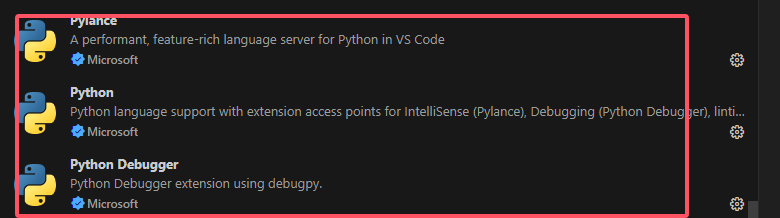
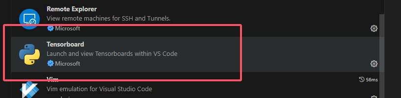
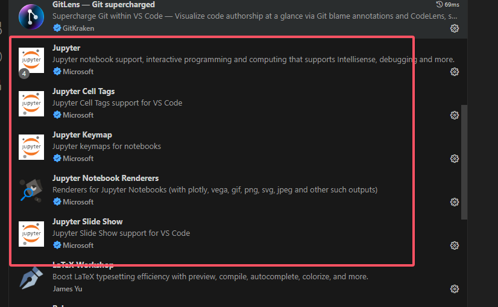

## 装环境

1.  QQ 微信 VScode（字体，自动保存） Joplin 本机cmd nvidia-smi看是否有显卡
2.  梯子
3.  github 本机.ssh conifg加github
4.  如果要用服务器：问实习生服务器的 ip 端口 用户和密码。  
    ssh-keygen -t ed25519 -C "your@email.com" -f C:/你的个人文件夹/.ssh/your-key-name（your-key-name 写你公司的名字）

  
注意路径，改 .config 文件中的 ssh。github.com 密钥路径  
4\. git clone  
5\. miniconda  
7\. conda init 完后，关掉 anaconda promt  
打开 terminal 应该就显示 (base) 了，但是会包红色的错  
你就输入这两行指令

Set-ExecutionPolicy -ExecutionPolicy RemoteSigned -Scope CurrentUser -Force

\[System.Environment\]::SetEnvironmentVariable('PSExecutionPolicyPreference', 'RemoteSigned', \[System.EnvironmentVariableTarget\]::User)  
然后关了重新开就没错了  
8\. python 别管  
9\. vscode装扩展  
  
  
  
  
10\. 装完后 ctrl ~ 在 vscode 打开终端  
11\. conda create -n 新环境 python=3.10 （有3.12，安装之前问一下  
12\. 然后打开你的工程，右下角选择你的新环境，再打开终端，conda activate 新环境，然后网上搜一下 pip 永久换清华源，换完之后  
pip install -r ./requirements.txt

### 包管理

## api

**Exa 的作用**：  
搜索功能：Exa 类用于执行特定类型的搜索，可能包括关键词搜索或使用神经网络的搜索（如脚本中的 type="neural"）。  
定制化搜索结果：该类允许用户通过传递多种参数来定制搜索结果，比如指定结果的数量、限制结果的时间范围、包含或排除特定文本或域名等。

## 代理

### 蓝灯梯子

http://127.0.0.1:51220/  
https://app.lantern.vip/lantern-installer-64.exe  
